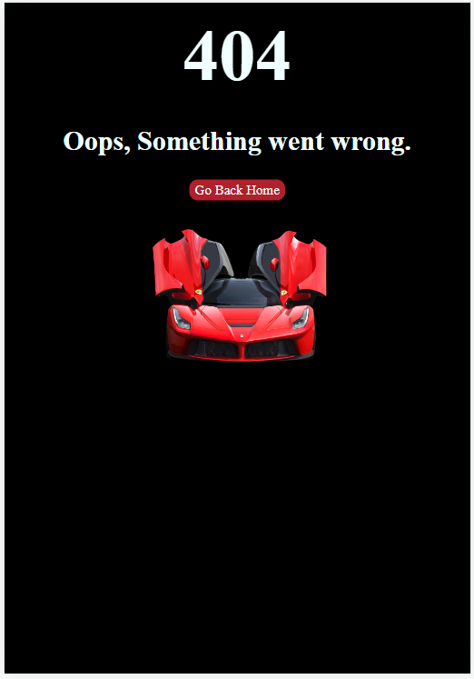

# Portfolio Project 1
## Supercar Driving Experience
This project was created as a school project for [Code Institute](https://codeinstitute.net/ie/). The inspiration for this website came from a business who offers supercar driving experiences. Please note that this project is not for a real company, however was inspired by one. The website main goals are to promote their business to potential customers by displaying information about the company and experiences available. 

[Live Project Here](https://dayana-n.github.io/portfolio-project-1/index.html)

## User Experience
### User Stories
#### First Time Visitor Goals
* As a first time user, I want to easily understand the main purpose of the site and learn more about the the business.
* As a first time user, I want to know what kind of experiences are available.
* As a first time user, I want to be able to navigate easily though the website.
* As a first time user, I want to be able to find contact details and location of the business.
* As a first time user, I want to be able to navigate through the website on my mobile device.
#### Returning Visitor Goals
* As a returning user, I want to be able to find the price of the experiences available.
* As a returning user, I want to be able to contact and/or book experience.
* As a returning user, I want to be find links to the company's social media.
## Design
### Color Scheme
The main colors used are red, black and azure. They were based on the hero image. During the design of the website shades of the main colors were used. 

### Typography
The fonts used are from [Google Fonts](https://fonts.google.com/specimen/Kanit?query=kanit) The main font of the website is Kanit and Sans-Serif is used as a fall back font.
### Images
The images used are from various sources which are linked in the credits section. The images were compressed to improve the performance of the website. 
### Wireframes
This website was design as scroll website with fixed navigation to help the user navigate easily through the website.
The initial idea for the experience cards was to have them with horizontal layout however due to the fact that the flow of information in the previous two sections was horizontal, decision was made for the cards to be vertical to break this pattern.

### Mockups
After the initial planning of the structure of the website, mockups were created on different sections of the website using Photoshop.
#### Main Page Mockup
Early planning of the design of the page.  

#### Circuit Mockup
The Circuit section was designed by using background image followed by transparent rectangular shape, png of the track and text.

#### Experiences Mockup
The experiences section was also designed visually in Photoshop first with improved layout.

#### Footer Mockup
Mockup of the Footer.

## Features
## Index Page
### Header
The header consist of two main elements, the logo on the left and the navigation bar on the right. When clicked the logo on the left takes the user to the home page.

The navigation bar consist of links to each section of the index page. On hover the each link is underlined and changes color. On click each link takes the user to the relevant section. Smooth scroll was added for better visual experience. The header is fixed to the top of the screen to ensure that the user can easily navigate through the sections at any time. 

### Hero Section
The hero section presents the user with a strong and colorful image. The image was carefully selected with the idea to represent to the user the feeling of adrenaline that comes with such an experience. 
On the left side in the hero section the text "If You Can Dream It, You Can Drive It! Enjoy a one-on-one experience in the car of your dreams." gives the user a brief description of the purpose of the website.  

### About Section 
The about section consist of an image on the left, representing the speed and adrenaline of the experience. On the right of the image there is more information about the website. This section was designed to give the user more information, quickly after landing on the page.  

### Circuit Section
The purpose of this section is to give the user more information about the circuit and help them visualise the track. The section was originally designed in photoshop by using background image of a track followed by transparent triangle shape, png file of the circuit and text.  

### Experiences Section
The experiences section clearly presents the available options to the user. Each experience consist of a card with the name and an image of the relevant car, specifications, price and book now button. On hover, shadow appears behind the cards. The background colour for the button and the price section was selected to catch the user's eye. On hover the button would increase size and change colour. On click, the button takes the user to the contact/booking form.

### Contact Section 
The contact section gives the user the opportunity to contact the business and enquire about bookings. The form consist of different input elements some of which are required. This is clearly presented to the user by adding the * symbol on the required fields for better user experience. The button Submit on hover changes colour and increases size. On click takes the user to the thank you page. 

### Footer
- The partners section consist of png images of the partner companies. On hover the images become colourful and the mouse turns into pointer. On click each partner image opens the link to the official website in new tab.
- Contact section provides clear contact information to the user. 
- The social media section consist of social media icons which on hover become colourful and the mouse turns into pointer. On click the social media links will open in new tab 
- The map section was added to help the user find the location of the business quicker without leaving the website.
- Copyright section, when clicked on the name of the student a link to LinkedIn opens in new tab.  

## Thank You Page
### Header 
For header details please refer to [Header](#header)
### Main content
The page consist of background image and a message letting the user know that the form submission was succesfull, followed by Go Back button which will take the user to the home page.  

### Footer
For footer details please refer to [Footer](#footer)

## 404 Page
### Main Content 
The 404 Page lets the user know that there is an error with their request and guides them to the home page.  

## Future Features 
- Hamburger menu for mobile screen using JavaScript
- Creating booking system behind the book now buttons. 
- Adding a little speaker icon in the corner of the experience card images, which when clicked will play the sound of the engine of the car. The speaker icon will then transform into stop icon with the help of JavaScript to give the user control over the sound. 

## Testing
Testing documentation can be found under [Testing.md](testing.md)

## Technologies and languages
- [HTML](https://web.dev/learn/html/overview/) was used to provide structure for this project
- [CSS](https://developer.mozilla.org/en-US/docs/Web/CSS) was used to style th HTML elements
- [GitHub](https://github.com/) is the hosting site used to store the code for the website
- [GitPod](https://gitpod.io/) was used to create this project
- [Code Institute Template](https://github.com/Code-Institute-Org/gitpod-full-template) was used as a starting point for the project
- [Photoshop](https://www.adobe.com/ie/products/photoshop.html) was used for creating the mockup images of the website during planning stage
- [Balsamiq](https://balsamiq.com/) was used to create the wireframes for the website
- [Favicon](https://favicon.io/) was used to create the favicon which displays in the tab of the browser
- [Fontawesome](https://fontawesome.com/) was used for the social media icons in the footer
- [Google Fonts](https://fonts.google.com/) was used to import fonts
- [Google Chrome Lighthouse](https://developers.google.com/web/tools/lighthouse) was used during testing of the website
- [Google Chrome Developer Tools](https://developer.chrome.com/docs/devtools/overview/) was used during testing, debugging and making the website responsive
- [W3C HTML Validator](https://validator.w3.org/) was used to check for errors in the HTML code
- [W3C CSS Validator](https://jigsaw.w3.org/css-validator/) was used to check for errors in the CSS code
- [Online Convert](https://image.online-convert.com/convert-to-webp) used to convert images to webp format
- [Coolors.co](https://coolors.co/) was used to display the colour scheme

## Deployment 
1. Navigate to the [repository](https://github.com/Dayana-N/portfolio-project-1)
2. Click on Settings on the top.
3. Click on Pages on the menu on the left which will open GitHub Pages window.
4. From the drop down menu under source select deploy from branch.
5. From the drop down menu under branch select main, this tells GitHub which branch to use for the deployment. Click Save.
6. The page should refresh and the deployment link should appear.

## Creating a fork
1. Navigate to the [repository](https://github.com/Dayana-N/portfolio-project-1)
2. In the top-right corner of the page click on the fork button and select create a fork.
3. You can change the name of the fork and add description 
4. Choose to copy only the main branch or all branches to the new fork. 
5. Click Create a Fork. A repository should appear in your GitHub

## Cloning Repository
1. Navigate to the [repository](https://github.com/Dayana-N/portfolio-project-1)
2. Click on the Code button on top of the repository and copy the link. 
3. Open Git Bash and change the working directory to the location where you want the cloned directory. 
4. type git clone and then paste the link.
5. Press Enter to create your local clone. 

## Credits
### Media 
