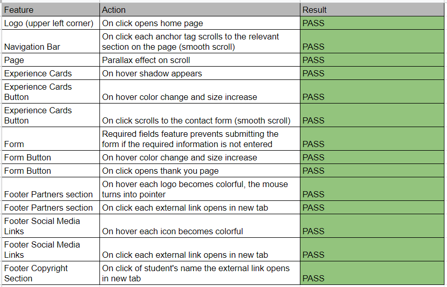

# Supercar Experience Testing Documentation
[Link to website](https://dayana-n.github.io/portfolio-project-1/index.html)  
[Link to GitHub Repository](https://github.com/Dayana-N/portfolio-project-1)

## Contents
* [User Story Testing](#user-story-testing)
* [Automated Testing](#automated-testing)
  * [The W3C Markup Validation Service](#the-w3c-markup-validation-service)
  * [The W3C CSS Validation Service](#the-w3c-css-validation-service)
  * [Google Lighthouse](#google-lighthouse)
* [Manual Testing](#manual-testing)
  * [Features Testing](#features-testing)
  * [Browser Testing](#browser-testing)
  * [Responsiveness Testing ](#responsiveness-testing)
* [Bugs](#bugs)
  
## User Story Testing
### As a first time user, I want to easily understand the main purpose of the website and learn more about the business.
- The home section of the website presents the user with a strong and colorful image in the hero section. This image was carefully selected with the idea to represent to the user the feeling of adrenaline that comes with such an experience.
- On the left side in the hero section the text "If You Can Dream It, You Can Drive It! Enjoy a one-on-one experience in the car of your dreams." gives the user a brief description of the purpose of the website. 
- The about section below the hero section was designed to give the user more information, quickly after landing on the page.
- The Circuit section provides additional information about the circuit, which also includes an image to help the user visualize the circuit. 
### As a first time user, I want to know what kind of experiences are available.
- The experiences section clearly presents the available options to the user. Each experience consist of a card with an image of the relevant car, specifications of the car and price. 
### As a first time user, I want to be able to navigate easily though the website.
- The navigation bar takes the user to each relevant section. The nav is also fixed to the top of the screen to provide better user experience. The user can easily navigate to each section at any time. Smooth scroll was added for better visual experience when navigating through the sections of the website.
### As a first time user, I want to be able to navigate through the website on my mobile device.
- The navigation bar is responsive and fixed on mobile devices as well to give the user the opportunity to easily navigate through each section.
### As a first time user, I want to be able to find contact details and location of the business.
- The footer of the website contains the full address, phone and email of the business. As an addition Google Maps location was added to help the user find the exact location quicker.
### As a returning user, I want to be able to find the price of the experiences available.
- Each card in the experiences section clearly states the starting price for each experience. This is displayed on red background to attract the attention of the user.
### As a returning user, I want to be able to contact and/or book experience.
- The Book Now button on each card takes the user to the contact form, where the user can fill in the required input fields in order to make booking. The buttons on the experience cards and the form, change color and increase size upon hover. The same red background was used to attract the attention of the user.
### As a returning user, I want to be find links to the company's social media.
- The footer contains social media links which upon hover change color. All external links open in new tab for better user experience.

## Automated Testing
### The W3C Markup Validation Service
- index.htm  
Document checking completed. No errors or warnings to show.

### Result - Pass
- thank-you.htm  
Document checking completed. No errors or warnings to show.

### Result - Pass
- 404.htm  
Document checking completed. No errors or warnings to show.

### Result - Pass

### The W3C CSS Validation Service
- All pages besides 404.html  
Congratulations! No Error Found.

  - One warning found. 
    
  This line of code was used to select and change the colour of the calendar picker icon in the date input field. This warning does not affect the performance of the element that it is connected to.
### Result - Pass
- 404 Page  
Congratulations! No Error Found.

Internal CSS was used on the 404.html page to prevent any potential errors.
### Result - Pass
### Google Lighthouse
#### The Google Lighthouse test was performed in incognito mode to prevent any add-ons interfering with the results.
- index.html Mobile  

- index.html Desktop  

  ### Result - Pass

- thank-you.html Mobile  
  

- thank-you.html Desktop  
  

    ### Result - Pass

- 404.html Mobile  
  

- 404.html Desktop  
  

- Warning on all pages 
This warning appears due to the fact that GitHub hosted pages disable FLoC, which is Google's 3rd party cookie alternative. - Source [Stackoverflow](https://stackoverflow.com/questions/69619035/error-with-permissions-policy-header-unrecognized-feature-interest-cohort) and [GithubBlog](https://github.blog/changelog/2021-04-27-github-pages-permissions-policy-interest-cohort-header-added-to-all-pages-sites/)  

  ### Result - Pass

## Manual Testing 
### Features Testing
- Index Page Features  

- Thank You Page Features  
  

- 404 Page Features  
  

### Browser Testing
Each page and features were tested on three browsers Google Chrome, Firefox and Microsoft Edge  

### Responsiveness Testing
Each page was tested using Developer Tools in Google Chrome Browser.  

- Samsung Galaxy S20 Ultra 412x915
  - Index page  
  
  - Thank you page  
  
  - 404 page  
  

-iPad Air 820x1180 
 - index Page  
 
 -Thank you page  
 
 - 404 page  
 

 ## Bugs